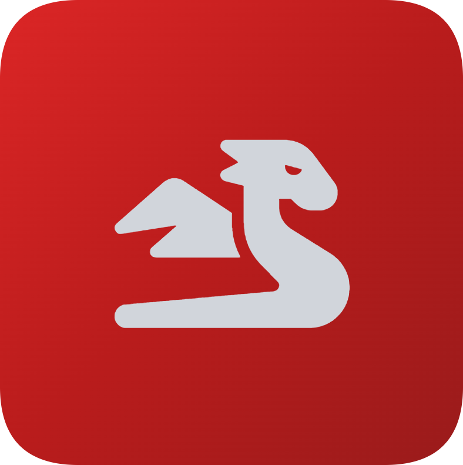
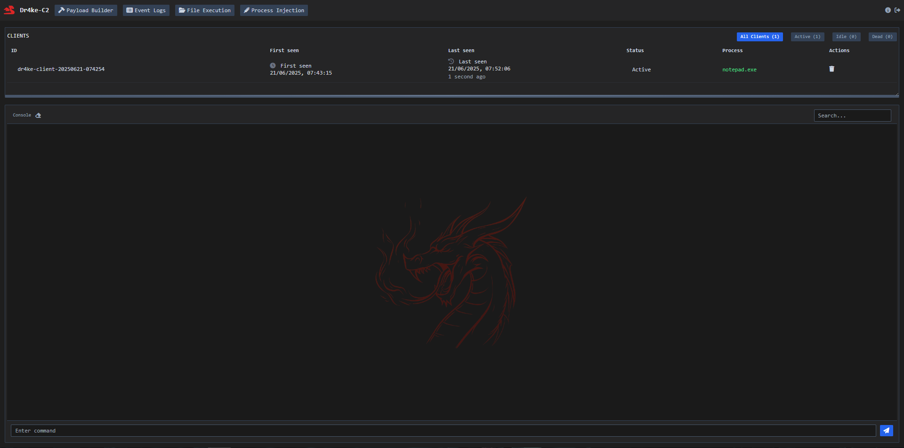
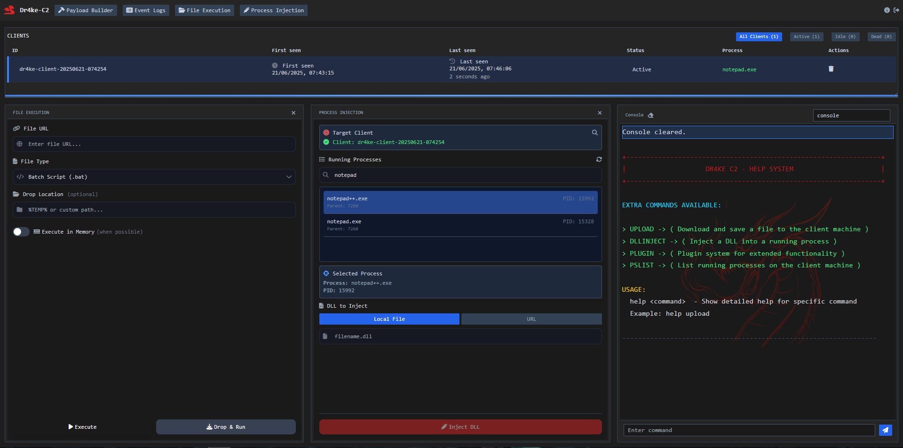

<div align="center">
  
  <h1>Dr4ke C2</h1>
  <br/>

  <p><i>Dr4ke is a simple and straightforward command and control framework created for educational purposes.</i></p>
  <br />

  <br />
  <br />
  
</div>

<div align="center">

[](https://golang.org/)
[](https://gcc.gnu.org/)
[](LICENSE)
[](https://www.microsoft.com/windows)

</div>

# Dr4ke C2
Dr4ke is a simple and lightweight C2 for penetration testers. Built in Go with a flexible architecture, it comes with a web-based panel for managing and controlling agents remotely.

### Features
- **Web Dashboard**: Modern web interface for managing clients and operations
- **Multi-format Support**: Generates EXE and DLL payloads
- **Plugin System**: Extensible architecture with custom plugin support (Discord Token, MessageBox)
- **Evasion**: Built-in AMSI/ETW bypass techniques with hardware breakpoints and memory patching
- **Process Injection**: DLL injection capabilities
- **File Operations**: File upload
- **Database Storage**: Flexible storage with BoltDB or in-memory options
- **Real-time Monitoring**: Live client status, system resource monitoring, and event logging
- **Batch Processing**: Efficient handling of multiple client operations
- **Encrypted Communications**: AES-256 encryption
- **Heartbeat System**: Maintains persistent connection with configurable intervals

**Available Plugins:**
- **Discord Token**: Extracts Discord authentication tokens
- **MessageBox**: Displays custom message boxes for social engineering
- **Custom Plugins**: Extensible plugin system for additional functionality

## Installation
```powershell
# Clone the repository
git clone https://github.com/vith0r/dr4ke-c2.git
cd dr4ke-c2

# Build from source
go build -o drake-c2.exe
```

## Configuration
Dr4ke C2 uses a JSON configuration file (`config.json`) that includes:
- Server settings (port, bind address, timeouts)
- Database configuration (BoltDB or in-memory)
- Batch processing options
- Advanced security settings

Example configuration:
```json
{
  "server": {
    "port": "8080",
    "host": "localhost",
    "staticFilesPath": "static",
    "clientLimit": 1000,
    "readTimeout": 60,
    "writeTimeout": 60,
    "idleTimeout": 300,
    "serverKey": "drake-c2"
  },
  "database": {
    "type": "bolt",
    "filePath": "server/database/data/clients.db",
    "cacheSize": 10000,
    "boltTimeout": 5,
    "noSync": false
  }
}
```

## Building and Starting the Server

```powershell
# Install dependencies
go mod download

# Compile the server
go build -o drake-c2.exe

# Basic usage with default settings
.\drake-c2.exe
```

**Building Clients**
1. Access the web dashboard at `http://localhost:8080`
2. Navigate to the Builder section
3. Configure payload options
4. Generate EXE or DLL payloads

## Contributors
Special thanks to the following contributor for their help with Dr4ke C2:

[@Anthony Sforzin](https://github.com/sys0xFF) - helped with the structure

## Contribute
If you find bugs or want to improve the project feel free to open a pull request and I will be glad to review and eventually merge your changes.

## Disclaimer
This project is strictly for educational and testing purposes. The C2 was built to be simple, lightweight, and straightforward — created as a personal experiment and a way to kill time.